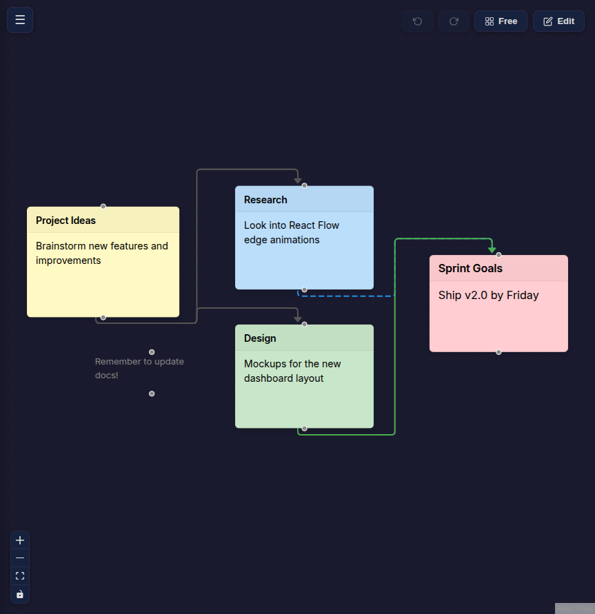
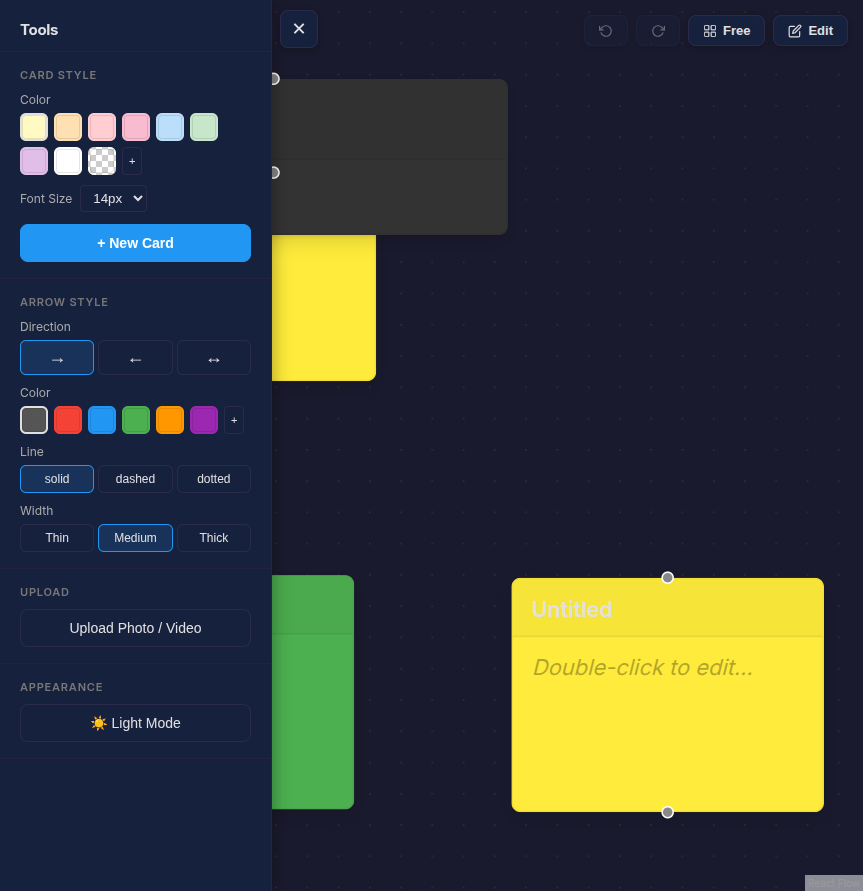
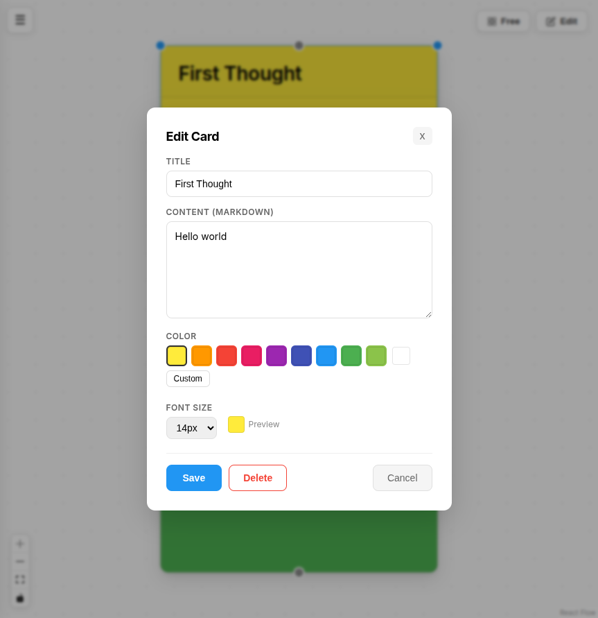
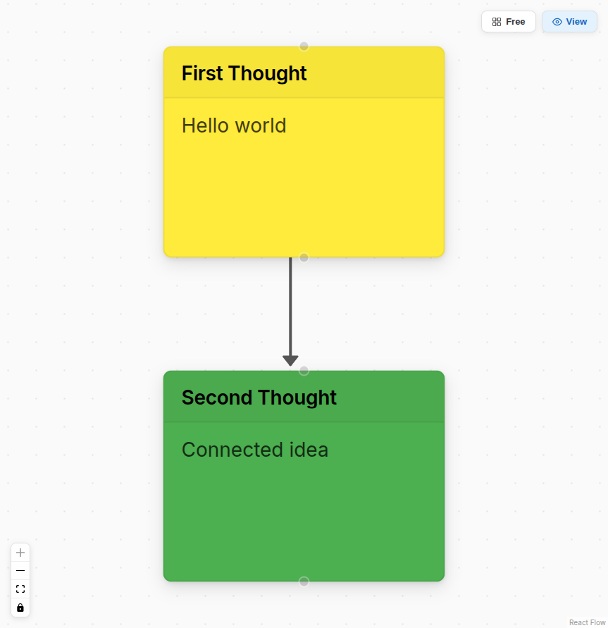

# Thoughts Organizer

A visual canvas for organizing thoughts as post-it style cards with customizable connections. Built with React Flow and FastAPI.



## Features

- **Post-it cards** with customizable colors, text colors, font sizes, and markdown content
- **Directional arrows** between cards — forward, reverse, or bidirectional with custom colors, line styles (solid/dashed/dotted), and thickness
- **Drag and drop** cards freely on an infinite canvas with pan and zoom
- **Auto-layout** mode using dagre for automatic tree arrangement
- **Edit / View modes** — full editing or clean read-only presentation
- **Dark / Light themes** with persistent preference
- **File attachments** — drag images onto the canvas or upload via the toolbar
- **Undo / Redo** for card creation, deletion, movement, and color changes (Ctrl+Z / Ctrl+Shift+Z)
- **Transparent cards** for floating text annotations
- **Card resizing** via drag handles

### Screenshots

| Toolbar (Dark Mode) | Editor Modal | View Mode |
|---|---|---|
|  |  |  |

## Tech Stack

| Layer | Technology |
|-------|-----------|
| Frontend | React 19, TypeScript, Vite |
| Canvas | [React Flow](https://reactflow.dev) (@xyflow/react) |
| State | [TanStack React Query](https://tanstack.com/query) |
| Layout | [Dagre](https://github.com/dagrejs/dagre) |
| Styling | CSS custom properties (light/dark themes) |
| Color Picker | [react-colorful](https://github.com/omgovich/react-colorful) |
| Markdown | [react-markdown](https://github.com/remarkjs/react-markdown) |
| Backend | Python, [FastAPI](https://fastapi.tiangolo.com) |
| Database | MongoDB 7 (via Docker) |
| Async Driver | [Motor](https://motor.readthedocs.io) |

## Getting Started

### Prerequisites

- **Docker** (for MongoDB)
- **Python 3.11+** (if using Python 3.12, install `python3.12-venv` package)
- **Node.js 18+**

### 1. Install Python venv (if needed)

If using Python 3.12 on Ubuntu/Debian:
```bash
sudo apt install python3.12-venv
```

### 2. Start MongoDB

```bash
docker compose up -d
# If using older docker-compose: docker-compose up -d
# May require sudo: sudo docker-compose up -d
```

This starts MongoDB on port 27017 with a persistent volume.

### 3. Start the Backend

```bash
cd backend
python3.12 -m venv .venv  # or python3.11 -m venv .venv
source .venv/bin/activate
pip install -r requirements.txt
uvicorn app.main:app --host 0.0.0.0 --port 8000
```

The API will be available at `http://localhost:8000`. Interactive docs at `http://localhost:8000/docs`.

### 4. Start the Frontend

```bash
cd frontend
npm install
npm run dev
```

Open `http://localhost:5173` in your browser. The Vite dev server proxies `/api` and `/uploads` requests to the backend.

## Project Structure

```
thoughts-organizer/
├── docker-compose.yml          # MongoDB service
├── backend/
│   ├── requirements.txt
│   ├── Dockerfile
│   └── app/
│       ├── main.py             # FastAPI app, CORS, static files
│       ├── config.py           # Environment config
│       ├── database.py         # MongoDB connection
│       ├── models/             # Pydantic models
│       │   ├── board.py
│       │   ├── card.py         # Card with color, text_color, font_size, card_type
│       │   └── connection.py   # Connection with direction + style
│       ├── routers/            # API endpoints
│       │   ├── boards.py
│       │   ├── cards.py
│       │   ├── connections.py
│       │   └── uploads.py
│       └── services/           # Business logic
│           ├── board_service.py
│           ├── card_service.py
│           └── connection_service.py
└── frontend/
    ├── package.json
    ├── vite.config.ts
    ├── index.html
    └── src/
        ├── main.tsx
        ├── App.tsx             # Theme provider, React Query, board loading
        ├── api/                # Axios API client layer
        ├── components/
        │   ├── Canvas/
        │   │   ├── Canvas.tsx      # Main ReactFlow orchestrator
        │   │   ├── LayoutToggle.tsx # Free / Auto layout toggle
        │   │   └── ModeToggle.tsx   # Edit / View mode toggle
        │   ├── Card/
        │   │   ├── CardNode.tsx     # Post-it card custom node
        │   │   ├── CardEditor.tsx   # Edit modal (title, content, color)
        │   │   ├── CardAttachment.tsx
        │   │   └── TextLabelNode.tsx
        │   └── LeftMenu/
        │       ├── LeftMenu.tsx     # Collapsible tools sidebar
        │       ├── ArrowPicker.tsx  # Arrow style customization
        │       ├── CardTemplates.tsx # Card color/font presets
        │       └── UploadButton.tsx
        ├── hooks/
        │   ├── useCards.ts         # Card CRUD mutations
        │   ├── useConnections.ts   # Connection mutations
        │   ├── useBoardMode.ts     # Edit/View context
        │   ├── useTheme.ts         # Light/Dark theme context
        │   └── useUndoRedo.ts      # Undo/redo action stack
        ├── types/index.ts
        ├── utils/layout.ts         # Dagre auto-layout
        └── styles/global.css       # CSS variables, themes
```

## API Endpoints

| Method | Path | Description |
|--------|------|-------------|
| `POST` | `/api/boards` | Create a board |
| `GET` | `/api/boards` | List all boards |
| `GET` | `/api/boards/{id}` | Get board with cards and connections |
| `DELETE` | `/api/boards/{id}` | Delete board (cascades) |
| `POST` | `/api/boards/{id}/cards` | Create a card |
| `PATCH` | `/api/cards/{id}` | Update card (partial) |
| `DELETE` | `/api/cards/{id}` | Delete card and its connections |
| `PATCH` | `/api/boards/{id}/cards/batch-position` | Batch update positions |
| `POST` | `/api/boards/{id}/connections` | Create connection |
| `DELETE` | `/api/connections/{id}` | Delete connection |
| `POST` | `/api/upload` | Upload a file |
| `POST` | `/api/cards/{id}/attachments` | Attach file to card |
| `DELETE` | `/api/cards/{id}/attachments/{att_id}` | Remove attachment |

## Usage

### Edit Mode
- **Create cards** via the left toolbar or the empty-state button
- **Edit cards** by double-clicking them to open the editor modal
- **Connect cards** by dragging from one card's handle (circle) to another
- **Customize arrows** using the Arrow Style section in the toolbar before connecting
- **Change colors** by selecting a card and picking a color from the toolbar
- **Delete cards** with the X button on each card, or select and press Delete
- **Undo/Redo** with the toolbar buttons or Ctrl+Z / Ctrl+Shift+Z
- **Upload images** via the toolbar button or drag-and-drop onto the canvas
- **Resize cards** by dragging their corner handles
- **Auto-layout** toggle arranges cards in a tree layout using dagre

### View Mode
- Pan and zoom to navigate
- All editing controls are hidden
- Cards display their content in a clean, read-only format

## License

MIT
